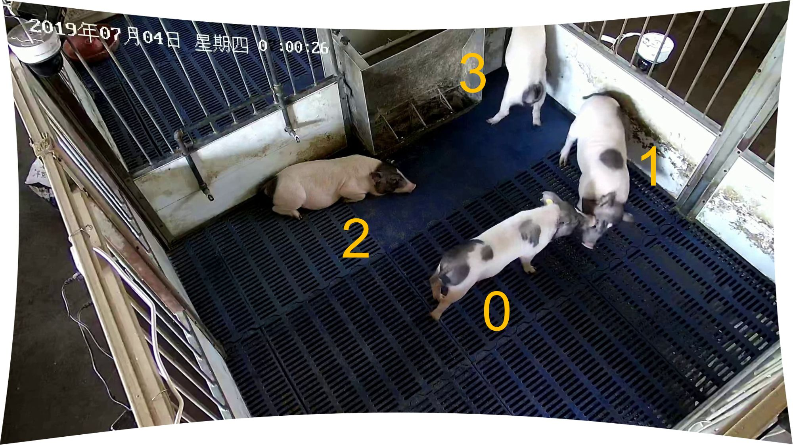
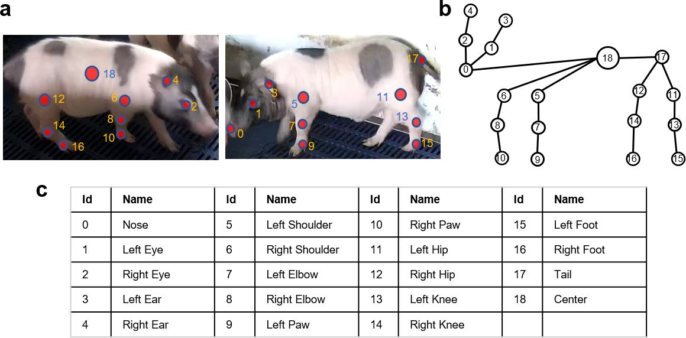

# Datasets proposed by MAMMAL
This repository presents how to download and use BamaPig2D and BamaPig3D datasets proposed in paper (TODO). 

# Download 
BamaPig2D (8.02GB for zipflie. 9.23G after unzip, yet occupy 10.7G space on windows) can be downloaded from [Google Drive](https://drive.google.com/file/d/1yWBtNpYpkUdGKDqUAE7ya5m_fwinn0HN/view?usp=sharing) or [Baidu Drive](https://pan.baidu.com/s/1vTwipVuXHNhBFc91tNXteQ) (extract code: vj9n).

BamaPig3D (8.86GB for zipfile. 9.62G after unzip yet occupy 24.9G space on windows because it contains many small files) can be downloaded from [Google Drive](https://drive.google.com/file/d/1TVQSWJl5VvXAGGG7cgFE_gVoziomPxmK/view?usp=sharing) or [Baidu Drive](https://pan.baidu.com/s/1KlljO0l8XgOmbrw8AUWj9A) (extract code: l70y).

BamaPig3D_pure_pickle (481M for zipfile, 579M after unzip, yet occupy 941M space on Windows. ). [Google Drive](https://drive.google.com/file/d/1PuJWS2CpUeQxOLw20OKFZQQcqMU-0uyk/view?usp=sharing) or [Baidu Drive](https://pan.baidu.com/s/1dizy8tOQTXW1DRIwLnuCig) (extract code: nfm2). This is a concise version containing only labeled images and labels. 
# Description

## BamaPig2D 
When you download `BamaPig2D.zip` and unzip it, you will get two folders: `images` and `annotations`. 
1. `images`: contains 3340 images used for training. 
2. `annotation`: contains two files. `train_pig_cocostyle.json` is for training and `eval_pig_cocostyle.json` is used for testing. Both are in COCO style, and you can read them using COCO PythonAPI. However, during training and testing, I modified PythonAPI. (TODO) Train split contains 3008 images and 10356 instances, while eval split contains 332 images and 1148 instances. 

## BamaPig3D
BamaPig3D dataset contains 1750 images with 70 ones annotated. The contents in each folder are described below. The annotations here are mainly `.json` file or `.txt` file which are more friendly to MATALB or C++ users.

1. `image` folder contains uncalibrated synchronized images. It has 10 folders. Each folder contains 1750 images of a single view. The camera names are `0`, `1`, `2`, `5`, `6`, `7`, `8`, `9`, `10`, `11`. Images are in `xxxxxx.jpg` name style. 
2. `label_images` folder contains calibrated images organized the same to `image` folder. `label_images` also contains 2D annotations as `xxxxxx.json` in the same folder to `xxxxxx.jpg`. Each `xxxxxx.json` file is the output of [LabelMe software](https://pypi.org/project/labelme/) and you can use `code/demo_readBamaPig3D.py` to check how to parse these 2D information and visualize them together with uncalibrated images. The pigs are labeled in the following order: 

</img>

3. `label_3d` folder contains 3D keypoints annotation. For pig `i` (`i=0,1,2,3`) and frame `k` (`k=0,25,...,1725`), the 3D keypoint file is `pig_{i}_frame_{k}.txt`. The 3D pig annotation follows the same order to 2D. 
 Each txt file is a `23*3` matrix, with the 18, 20, 22, 23 rows always set zero. Invisible keypoints without 3D labels are set to zero. Therefore, only 19 keypoints are valid which names are defined in the order: 

</img>

4. `label_mesh` is organized same to `label_3d`. The difference is, its keypoints totally come from the labeled mesh (i.e. the PIG model), whose pose parameters are stored in `label_pose_params`. You can use `bodymodel_np.py` and the PIG model files (see `link to PIG model(TODO)`) to read these pose params and regress the keypoints from pose parameters. 

5. `label_mix` is organized same to `label_3d`. It is the final 3D keypoint labeling combining `label_3d` and `label_mesh`. All the experiments in the paper are performed on this labeling. Please refer to the paper for detailed decription. 

6. `boxes_pr` and `masks_pr` are detection results from `PointRend` (link to it. TODO) using our weights pre-trained on BamaPig2D dataset (link to it). To read and render the bounding boxes and the masks, refer to the code `code/TODO`.

7. `keypoints_hrnet` are keypoint detection results from `HRNet` (link to it) using our weights pre-trained on BamaPig2D dataset. Use `code/TODO` to read and render it. Note that, `boxes_pr`, `masks_pr` and `keypoints_hrnet` are the detection results used to generate evaluation results in Fig.2 and the video in Supplementary Video 1 of the paper. You can test other 3D reconstruction methods fairly based on these baseline results, or just use your own detection methods to generate another detection results. 

8. `extrinsic_camera_params` contains 10 camera extrinsic paramters in `{camid}.txt` file. For example, for `00.txt`, it contains 6 float number, with the first three are camera rotation in axis-angle format, the last three are translation in xyz order. Unit is meter. `marker_3dpositions.txt` contains the 3d positions of 75 scene points for extrinsic camera parameter solving with PnP algorithm (see Supplementary Fig. 1 in the paper). `markerid_for_extrinsic_pnp.ppt` shows how these 75 points correspond to the scene. `markers{camid}.png` shows the projection of 3d scene points (red) and labeled 2d points on the image (green). It indicates how well the extrinsic parameters are solved. 

9. `intrinsic_camera_params` contains two pickle file (a binary file format, see [python doc](https://docs.python.org/3/library/pickle.html)). You can also find the intrinsic parameters in `undistortion.py` file. 

## BamaPig3D_pure_pickle
This is a slim version of BamaPig3D, in which we remove `images`, `boxes_pr`, `keypoints_hrnet`, `masks_pr` folders. Only labeled images and labels are reserved. To save space, all label data are in `.pkl` format. `read_2dlabel_to_pickle` function in `visualize_BamaPig3D.py` shows how to encode 2D labels to pickle file. `label_mesh.pkl`, `label_3d.pkl` and `label_mix.pkl` are 70x4x19x3 matrices. `label_pose_params.pkl` is a dict seperating pose parameters to different parts, see information in the dict. 

# Demo code requirements
These functions are tested on Python 3.7 with conda virtual environment. The following python packages are necessary to run the codes in `code/` folder. Simply install the newest version. 
* scipy 
* numpy 
* opencv-python
* videoio 
* ipython 
* tqdm 
* matplotlib 
* pyflann

Specifically, after install anaconda (follow https://www.anaconda.com/ to install the newest version), you can create a conda virtual environment by running 
```shell
conda create -n MAMMAL python=3.7.9
conda activate MAMMAL
pip install scipy numpy opencv-python videoio 
pip install ipython 
pip install tqdm matplotlib pyflann-py3
```
It works for both windows 10 and ubuntu 20.04 (other mainstream windows and ubuntu version may work as well). If the installation of some packages fail, just try to install them again. If always fail, you may need to google the solution. 

# Demo code description
`utils.py` contains some keypoint structure definitions.

`visualize_BamaPig2D.py` tells how to load and visualize 2d labels onto images, and generate Supplementary Fig. 3b and 3d. 

`visualize_BamaPig3D.py` tells how to load 2d keypoints in BamaPig3D dataset and generate Supplementary Fig. 6c and 6d. 

`bodymodel_np.py` is used to drive the PIG model. You should have prepared model files of the PIG model before run this file. 

`assemble_BamaPig3D.py` shows the procedure of Supplementary Fig. 6b. 

`undistortion.py` contains the intrinsic calibration parameters

<!-- ### Agreement
1. The BamaPig2D and BamaPig3D datasets (the "Datasets") are available for **non-commercial** research purposes only. Any other use, in particular any use for commercial purposes, is prohibited. This includes, without limitation, incorporation in a commercial product, use in a commercial service, as training data for a commercial product, for commercial ergonomic analysis (e.g. product design, architectural design, etc.), or production of other artifacts for commercial purposes including, for example, web services, movies, television programs, mobile applications, or video games. The datasets may not be used for pornographic purposes or to generate pornographic material whether commercial or not. The Datasets may not be reproduced, modified and/or made available in any form to any third party without Tsinghua University’s prior written permission.

2. You agree **not to** reproduce, modified, duplicate, copy, sell, trade, resell or exploit any portion of the images and any portion of derived data in any form to any third party without Tsinghua University’s prior written permission.

3. You agree **not to** further copy, publish or distribute any portion of the Dataset. Except, for internal use at a single site within the same organization it is allowed to make copies of the dataset.

4. Tsinghua University reserves the right to terminate your access to the Dataset at any time. -->

# Citation


# Contact
Liang An ([anl13@mail.tsinghua.org.cn](anl13@mail.tsinghua.org.cn))
Yebin Liu ([liuyebin@mail.tsinghua.edu.cn](liuyebin@mail.tsinghua.edu.cn))